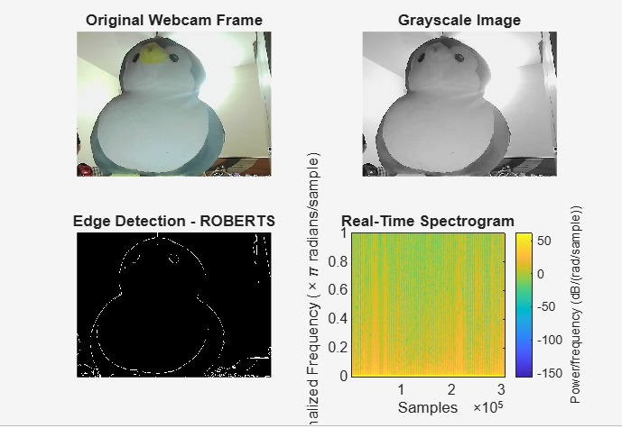
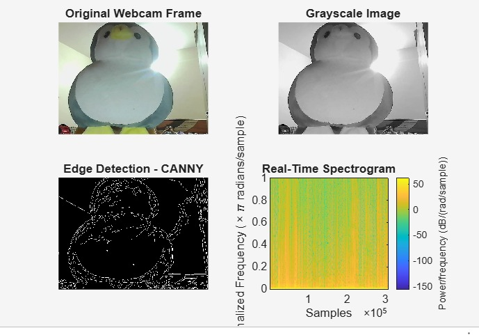
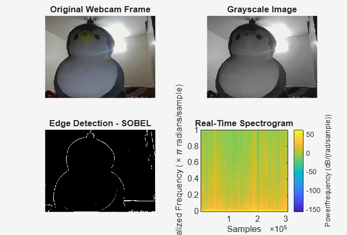

# Real-Time Edge Detection using MATLAB

## Overview

This project implements real-time edge detection using a webcam in MATLAB. The application captures live video frames, converts them to grayscale, and applies different edge detection algorithms to identify object boundaries. It also displays a spectrogram for visual analysis of the captured image.

---

## Features

- Live webcam video capture
- Real-time grayscale conversion
- Edge detection using:
  - Roberts
  - Canny
  - Sobel
- Spectrogram visualization
- Easy selection of edge detection algorithms

---

## Technologies Used

- MATLAB
- Image Processing Toolbox
- MATLAB Support Package for USB Webcams

---

## Requirements

- MATLAB R2022a or later
- Image Processing Toolbox
- Webcam (Built-in or USB)

---

## How to Run

1. Connect your webcam.
2. Open `Realtime_edge_detection.m` in MATLAB.
3. Select the desired edge detection method by changing:

```matlab
method = 'canny';
```

Available methods:

- `'roberts'`
- `'canny'`
- `'sobel'`

4. Run the script.

---

## Sample Outputs

### Roberts Edge Detection


### Canny Edge Detection


### Sobel Edge Detection


---

## Future Improvements

- Graphical User Interface (GUI)
- Additional edge detection algorithms
- Real-time FPS (Frames Per Second) display
- Video recording support
- FPGA-based hardware implementation for faster processing

---

## Author

**Pallavi Doddamani**  
B.E. Electronics and Communication Engineering  
BMS College of Engineering
